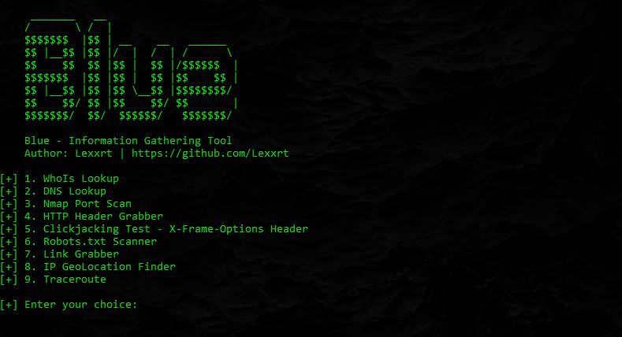

<h2><strong>Blue</strong></h2>

*Usage:*

1. Install Libraries: `chmod +x ./install_libs.sh && ./install_libs.sh` 📜
2. Start up Blue: `python3 Blue.py` 🚀

> 

*Options:*

1. Whois Lookup: `Preforms a Whois lookup`
2. DNS Lookup: `Preforms a DNS lookup`
3. Nmap Port Scan: `Port scan using Nmap (Full Scan)`
4. HTTP Header Grabber: `Retrieve HTTP headers`
5. Clickjacking Test: `Checkes for the 'X-Frame-Options' Header`
6. Robots.txt Scanner: `Retrieves 'robots.txt' of a site` 
7. Link Grabber: `Fetches all links in a web page`
8. IP Geo-Location Finder: `Find IP's Geo-Location`
9. Traceroute: `Preforms a 'Traceroute' Scan`

⚠️ *Disclaimer* ⚠️

`This tool is for educational purposes only. I am not responsible for any damage you cause.`
